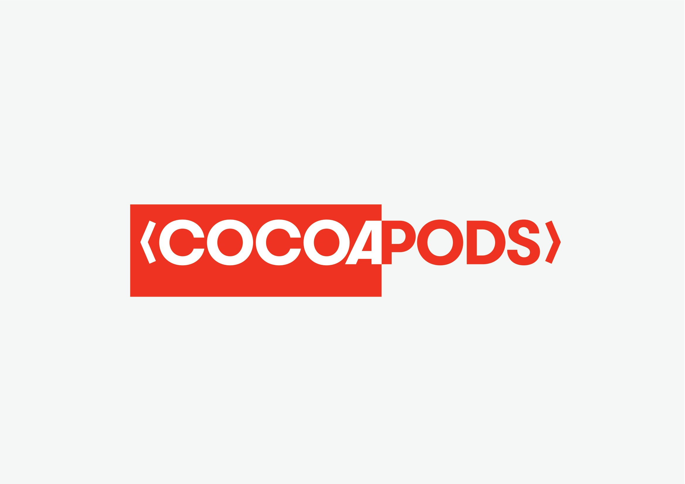

## CocoaPods Media Pack

*Note* We use a capital *P* in CocoaPods, it's an uphill battle, but worth it :D

So you want to use the CocoaPods logo? Ace.

1st off we have the vectors in [Sketch format](https://github.com/CocoaPods/shared_resources/tree/master/design/sketch).

Next up, the Logo in order of our preference. 
  
  
  
  
  
  
  
  
  
  
Then if you're just using CocoaPods in reference to some other tools, it may make sense to use our twitter avatar:

  
